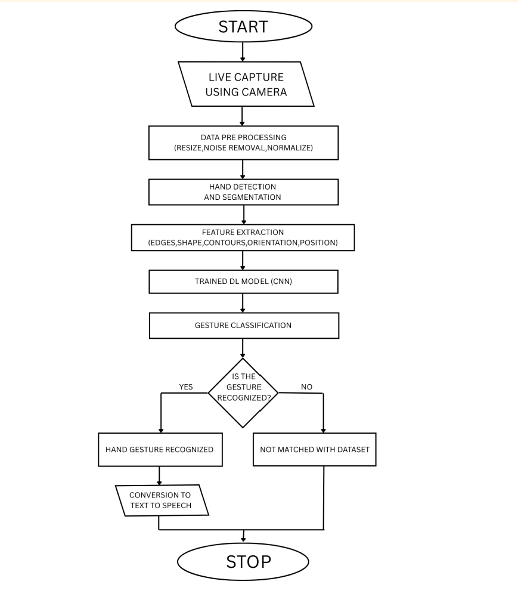
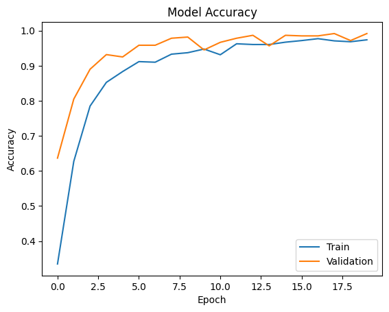
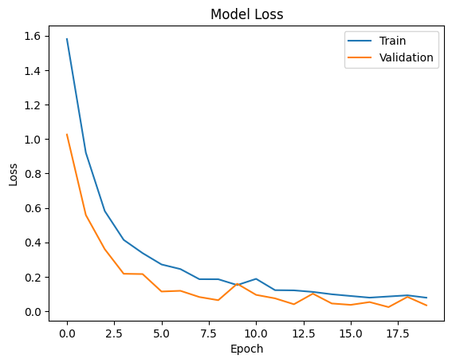
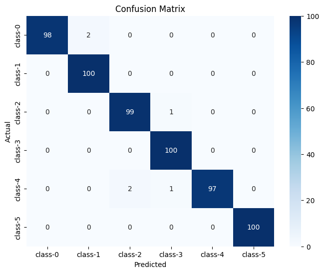
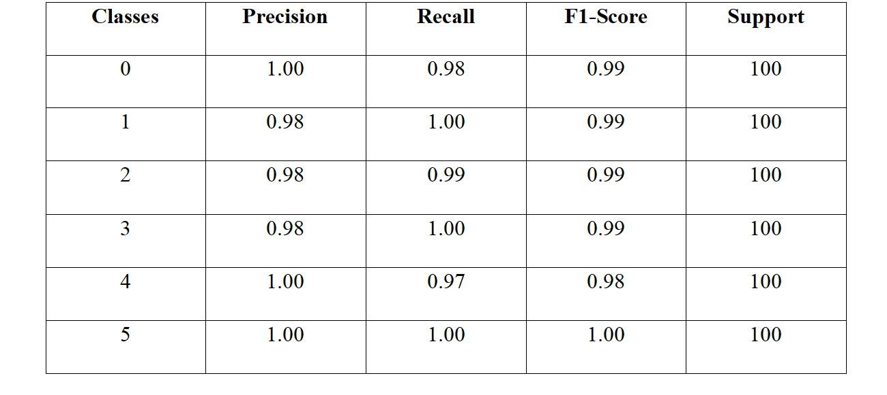
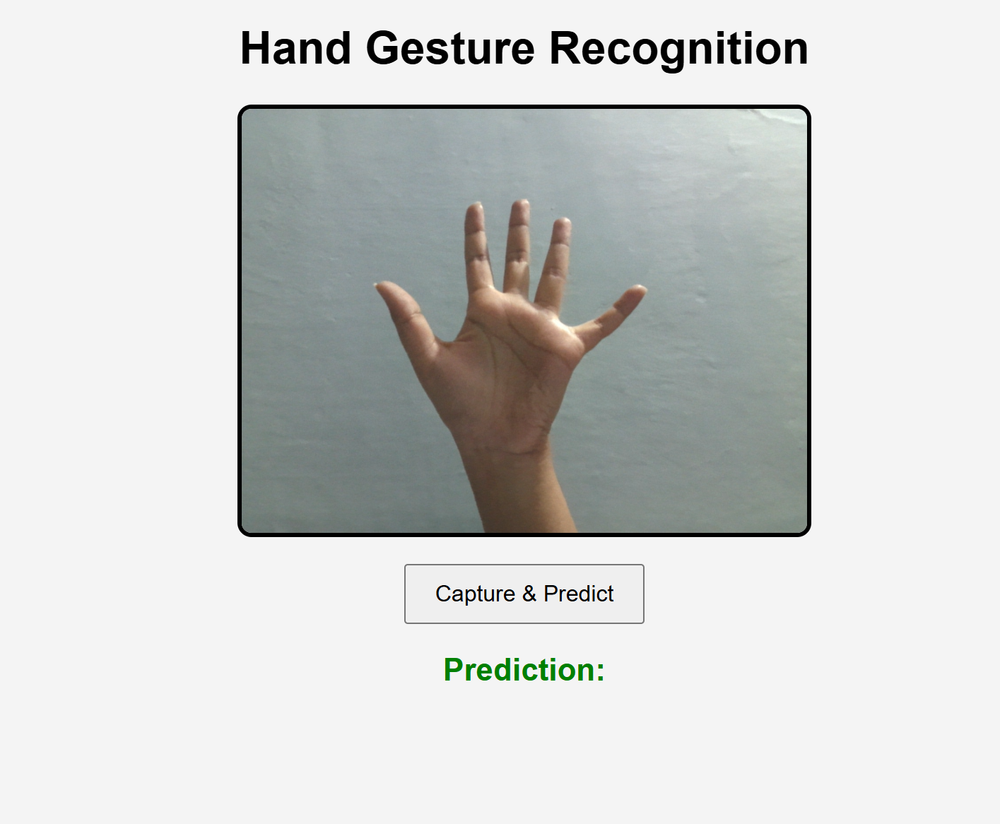
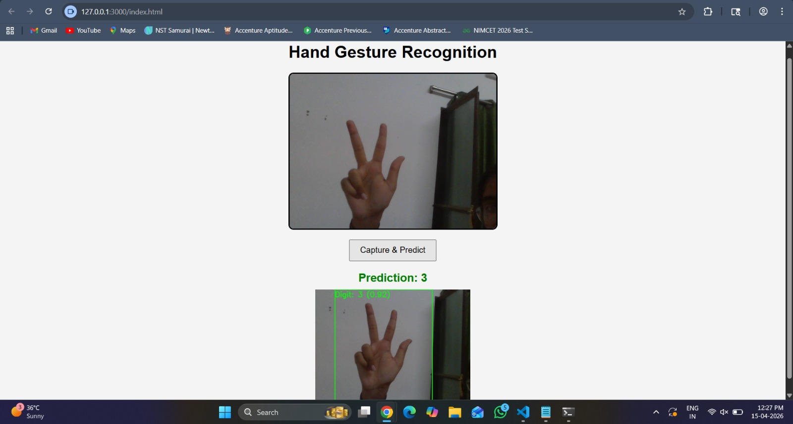
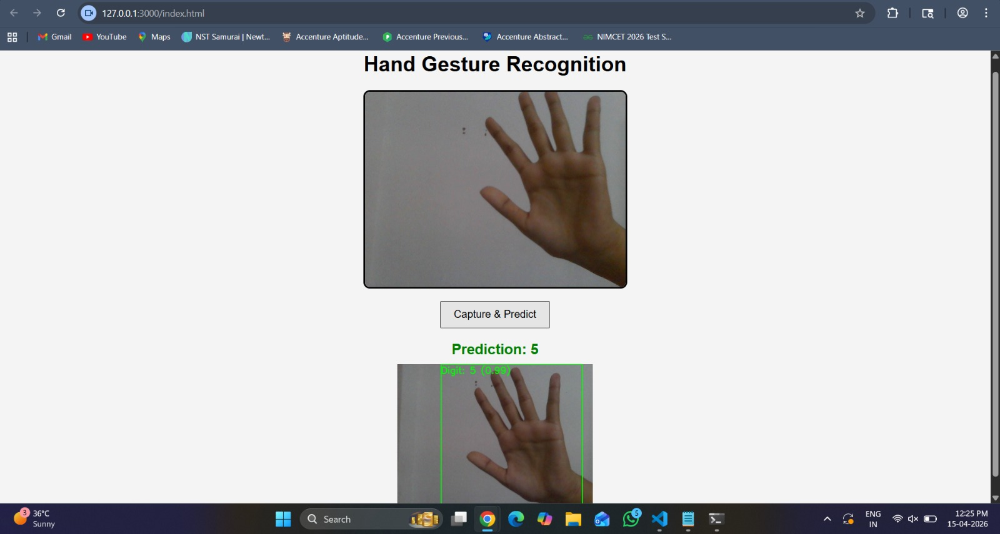

# ✋ Hand Gesture Recognition System

A Computer Vision-based Hand Gesture Recognition System that recognizes numerical hand gestures (0–5) using **MediaPipe** for hand detection and a **Convolutional Neural Network (CNN)** for gesture classification.

The system captures an image from a webcam when the user clicks the **Capture & Predict** button, detects the hand region, applies image preprocessing techniques, and predicts the corresponding digit along with its confidence score. The prediction is displayed on the user interface together with the **annotated image**, while voice feedback is generated using the browser's **Speech Synthesis API** to provide an interactive and user-friendly experience.

This project demonstrates the integration of **Computer Vision**, **Deep Learning**, and **Web Technologies** to develop a robust hand gesture recognition system for human-computer interaction applications.

---

> **📌 Project Note**
>
> This project was developed collaboratively as a **BCA Final Year Project** at **Banasthali Vidyapith** by **Bhagyashree Gautam**, **Anvesha Sharma**, and **Avani Gour**.
>
> The repository is maintained for portfolio and educational purposes. All contributors participated in the design, implementation, experimentation, and documentation of the project.

---

## 🚀 Features

- Interactive web interface for capturing hand gesture images using a webcam.
- Automatic hand detection and localization using **MediaPipe Hands**.
- Image preprocessing including duplicate image removal, hand cropping, HSV-based skin segmentation, resizing, and normalization.
- Recognition of numerical hand gestures (**0–5**) using a **Convolutional Neural Network (CNN)**.
- Displays the predicted digit together with its confidence score.
- Annotates the detected hand with a bounding box and prediction label.
- Provides voice feedback using the browser's **Speech Synthesis API**.
- Flask-based REST API for seamless communication between the frontend and the deep learning model.
- Modular and well-organized project structure for easy maintenance and future enhancements.

---

## 🛠️ Technologies Used

| Technology | Purpose |
|------------|---------|
| **Python** | Core programming language used for development |
| **TensorFlow (Keras API)** | Building, training, and deploying the CNN model |
| **MediaPipe Hands** | Hand detection and landmark extraction |
| **OpenCV** | Image processing and preprocessing |
| **Flask** | Backend REST API for model deployment |
| **HTML, CSS & JavaScript** | Frontend user interface |
| **NumPy** | Numerical computations and array operations |
| **Matplotlib** | Visualization of training and validation metrics |
| **Scikit-learn** | Performance evaluation using confusion matrix and classification report |
| **Seaborn** | Visualization of the confusion matrix |
| **ngrok** | Secure tunneling for exposing the local Flask server |

---

## 📂 Project Structure

```text
Hand-Gesture-Recognition-System/
│
├── assets/
│   ├── workflow.png
│   ├── mediapipe_landmarks.png
│   └── hand_gesture_demo.mp4
│
├── data/
│   ├── kaggle_sample/
│   └── custom_sample/
│
├── model/
│   └── gesture_model.keras
│
├── results/
│   ├── accuracy_graph.png
│   ├── loss_graph.png
│   ├── confusion_matrix.png
│   ├── classification_report.png
│   └── hyperparameter_comparison.xlsx
│
├── screenshots/
│   ├── home_interface.png
│   ├── prediction_3.jpg
│   └── prediction_5.jpg
│
├── src/
│   ├── notebooks/
│   │   ├── model_training.ipynb
│   │   └── flask_deployment.ipynb
│   ├── data_preprocessing.py
│   └── interface.html
│
├── .gitignore
├── requirements.txt
└── README.md
```

---

## 📊 Dataset

This project utilizes two datasets during the development and evaluation of the Hand Gesture Recognition System.

### Kaggle Dataset

The Kaggle dataset served as the primary source for training the final Convolutional Neural Network (CNN) model. It consists of well-organized hand gesture images representing numerical gestures (**0–5**) and provides a diverse collection of samples for developing a robust gesture recognition system.

### Custom Dataset

A custom dataset was created by capturing hand gesture images using a webcam. It contains the same numerical gesture classes (**0–5**) and was preprocessed before model training.

The custom dataset was used to train a separate CNN model and compare its performance with the model trained on the Kaggle dataset. This comparison helped analyze the impact of dataset size and quality on model performance while assessing the suitability of a smaller, self-collected dataset for hand gesture recognition.

### Dataset Source

#### Existing Dataset (Kaggle)

- **Dataset:** American Sign Language Digit Dataset
- **Source:** [American Sign Language Digit Dataset (Kaggle)](https://www.kaggle.com/datasets/rayeed045/american-sign-language-digit-dataset)
- **Gesture Classes Used:** 6 (Digits **0–5**)
- **Dataset Size:** **3,000 images** (500 images for each of the six gesture classes used in this project)
- **Train-Test Split:** **80% Training, 20% Testing**

This dataset served as the primary source for training the final CNN model due to its well-organized and standardized collection of hand gesture images.

#### Custom Dataset

- **Gesture Classes:** 6 (Digits **0–5**)
- **Dataset Size:** Approximately **1,200 images** (≈200 images per class)
- **Train-Test Split:** **80% Training, 20% Testing**

The custom dataset was manually created using a webcam, preprocessed, and used to train a separate CNN model for comparative performance evaluation against the model trained on the Kaggle dataset.

---

## 🧹 Data Preprocessing

The preprocessing pipeline was applied to the custom dataset to prepare the images for model training, reduce background noise, and generate consistent input images for the CNN model. The following steps were performed:

1. **Duplicate Image Removal**
   - Duplicate images were identified and removed using hashing techniques to eliminate redundant samples and improve dataset quality.

2. **Hand Detection**
   - **MediaPipe Hands** was used to accurately detect the hand region in each image.

3. **Hand Cropping**
   - A bounding box was generated around the detected hand, and the hand region was cropped to remove unnecessary background information.

4. **HSV-based Skin Segmentation**
   - HSV color thresholding was applied to isolate the hand region from the background, allowing the model to focus on gesture-specific features.

5. **Image Resizing**
   - All cropped hand images were resized to **64 × 64 pixels** to ensure a consistent input size for the CNN model.

6. **Normalization**
   - Pixel values were normalized to the range **[0, 1]** by dividing each pixel value by **255**, improving training stability and model convergence.

The preprocessed images provided standardized inputs for CNN training and comparative performance evaluation.

---

## 🧠 Model Architecture

A **Convolutional Neural Network (CNN)** was developed to classify hand gesture images into six numerical gesture classes (**0–5**). The model automatically learns hierarchical visual features from the preprocessed images and predicts the corresponding gesture class.

The CNN architecture consists of the following layers:

1. **Input Layer**
   - Accepts RGB images of size **64 × 64 × 3**.

2. **Convolutional Layers**
   - Three convolutional layers with **32**, **64**, and **128** filters, respectively, use the **ReLU** activation function to extract low-level and high-level image features.

3. **Max Pooling Layers**
   - Each convolutional layer is followed by a max pooling layer to reduce the spatial dimensions of the feature maps while preserving important features.

4. **Flatten Layer**
   - Converts the extracted feature maps into a one-dimensional feature vector.

5. **Fully Connected Layer**
   - A dense layer with **128 neurons** and **ReLU** activation learns complex feature representations.

6. **Dropout Layer**
   - A dropout rate of **0.5** is applied to reduce overfitting and improve the model's generalization capability.

7. **Output Layer**
   - A dense layer with **6 neurons** and **Softmax** activation classifies the input image into one of the six numerical gesture classes (**0–5**).

### Model Configuration

- **Input Image Size:** 64 × 64 × 3
- **Batch Size:** 32
- **Epochs:** 20
- **Optimizer:** Adam
- **Loss Function:** Categorical Crossentropy
- **Evaluation Metric:** Accuracy
- **Number of Classes:** 6 (Digits 0–5)

## 🔄 System Workflow

The overall workflow of the Hand Gesture Recognition System is illustrated below.



The system follows the workflow shown above to recognize numerical hand gestures. The complete process consists of the following stages:

1. **Image Capture**
   - The user captures a hand gesture image through the web interface using the webcam.

2. **Data Preprocessing**
   - The captured image is resized and normalized to prepare it for further processing.

3. **Hand Detection and Segmentation**
   - **MediaPipe Hands** detects the hand region, after which hand cropping and HSV-based skin segmentation are performed to isolate the gesture.

4. **Gesture Classification**
   - The processed image is passed to the trained **Convolutional Neural Network (CNN)**, which predicts the corresponding numerical gesture (**0–5**) along with its confidence score.

5. **Result Generation**
   - The predicted gesture, annotated image, confidence score, and voice feedback are presented to the user through the web interface.

---

## 📈 Model Performance

The performance of the Convolutional Neural Network (CNN) model was evaluated using validation accuracy, validation loss, confusion matrix analysis, and classification metrics. Multiple experiments were conducted using different batch sizes and training epochs to determine the optimal training configuration.

### Hyperparameter Evaluation

The model was trained using batch sizes of **16, 32, 64, 128, and 256** over **3, 5, 10, and 20 epochs**. The experimental results indicate that increasing the number of training epochs generally improved validation accuracy. Among the evaluated configurations, a batch size of **32** achieved the highest validation accuracy and the lowest validation loss, while larger batch sizes showed a gradual reduction in performance.

The best performance was achieved using the following configuration:

- **Batch Size:** 32
- **Epochs:** 20
- **Validation Accuracy:** **98.17%**
- **Validation Loss:** **0.0559**

### Training Performance

The following visualizations summarize the training behavior and classification performance of the CNN model.

#### Training and Validation Accuracy



The training and validation accuracy curves demonstrate a consistent improvement throughout the training process, indicating effective feature learning by the CNN model.

#### Training and Validation Loss



The training and validation loss curves show a steady reduction during training, indicating stable model convergence and effective learning of gesture-related features.

### Classification Performance

#### Confusion Matrix



The confusion matrix demonstrates that most predictions are concentrated along the diagonal, indicating correct classification for the majority of hand gesture samples. Only a few misclassifications are observed among visually similar gesture classes.

#### Classification Report



The classification report indicates consistently high precision, recall, and F1-score across all six gesture classes, with values ranging from **0.97 to 1.00**. These results demonstrate that the CNN model accurately recognizes numerical hand gestures while maintaining balanced performance across different classes.

### Hyperparameter Comparison

A detailed comparison of all evaluated hyperparameter configurations is provided in the repository as:

`results/hyperparameter_comparison.xlsx`

---

## 📷 Screenshots

### Home Interface

The web interface allows users to capture a hand gesture image using the webcam and perform gesture prediction.



---

### Gesture Prediction – Digit 3

The system displays the annotated image, predicted gesture, and confidence score after processing the captured hand gesture.



---

### Gesture Prediction – Digit 5

Another prediction illustrating the recognition of a different numerical hand gesture with its corresponding confidence score.



---

## ⚙️ Installation & Usage

### Prerequisites

- Python 3.x
- Google Colab or Jupyter Notebook
- Git
- Webcam

### Installation

1. Clone the repository.

```bash
git clone https://github.com/<your-username>/Hand-Gesture-Recognition-System.git
```

2. Navigate to the project directory.

```bash
cd Hand-Gesture-Recognition-System
```

3. Install the project dependencies.

```bash
pip install -r requirements.txt
```

### Running the Project

1. Open **`src/notebooks/flask_deployment.ipynb`** in **Google Colab** or **Jupyter Notebook**.

2. Run all notebook cells sequentially to start the Flask server and generate the deployment URL.

3. Update the Flask/ngrok URL in **`src/interface.html`** if required.

4. Open **`src/interface.html`** in a web browser.

5. Allow webcam access when prompted.

6. Click **Capture & Predict** to recognize the hand gesture and view the predicted digit, confidence score, annotated image, and voice feedback.

---

## 🚀 Future Improvements

The Hand Gesture Recognition System can be further enhanced through the following improvements:

- Extend the system to recognize a larger set of hand gestures beyond numerical digits (**0–5**).
- Support real-time continuous gesture recognition from live video streams instead of single image capture.
- Improve model robustness under varying lighting conditions, backgrounds, and hand orientations.
- Explore advanced deep learning architectures to further improve gesture recognition performance.
- Develop a mobile-friendly version for deployment on smartphones and embedded devices.
- Integrate gesture recognition with additional human-computer interaction applications.

---

## 👨‍💻 Contributors

This project was developed as a **BCA Final Year Project** at **Banasthali Vidyapith** by:

- **Bhagyashree Gautam**
- **Anvesha Sharma**
- **Avani Gour**

---
